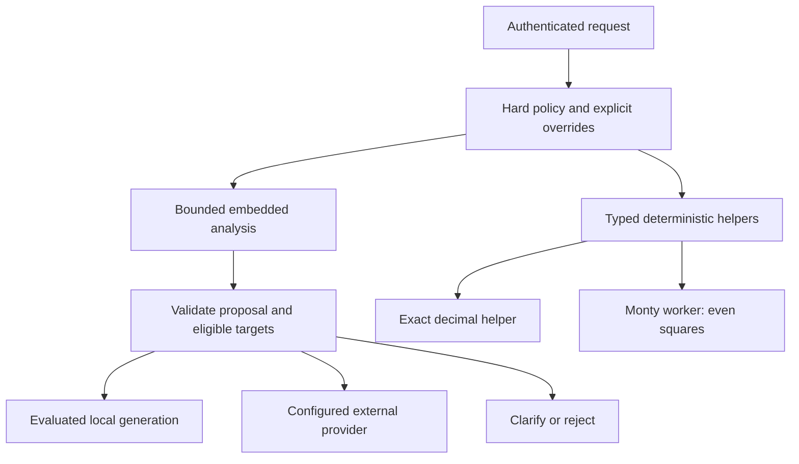

# Open Model Orchestrator (OMO)

A small Python agent with a bundled generative CPU model, exact computation, a bounded Python-subset sandbox, and policy-controlled external model routing.

**V0.1 development baseline.** Real local inference and sandbox execution are implemented. Local generation is deliberately limited to four evaluated English questions. Open-ended local reasoning, reliable learned routing, multilingual answers, autonomous generated code, training and stable model promotion are not claimed.

## Run locally

Python 3.12, `uv`, and a C/C++ build toolchain are required for the first installation. On macOS use Apple Clang; on Linux install GCC/G++ and CMake. The selected model is 386,404,992 bytes.

```bash
uv sync --locked
uv run --no-sync python scripts/download_model.py
OMO_SANDBOX_ENABLED=true uv run --no-sync omo
```

Linux toolchain override if the environment points at an unavailable compiler:

```bash
CC=gcc CXX=g++ CMAKE_ARGS='-DGGML_NATIVE=OFF -DGGML_BLAS=OFF -DGGML_OPENMP=OFF' \
  uv sync --locked
```

The server binds to `127.0.0.1:8000`. Local operations require no provider key. Startup validates the pinned model checksum, loads one model worker and warms it before readiness. No downloads occur in request processing.

```bash
curl -s http://127.0.0.1:8000/v1/chat/completions \
  -H 'Content-Type: application/json' \
  -d '{"messages":[{"role":"user","content":"What is gravity?"}]}'
curl -s http://127.0.0.1:8000/v1/chat/completions \
  -H 'Content-Type: application/json' \
  -d '{"messages":[{"role":"user","content":"calc 0.1 + 0.2"}]}'
curl -s http://127.0.0.1:8000/v1/chat/completions \
  -H 'Content-Type: application/json' \
  -d '{"messages":[{"role":"user","content":"Square the even numbers"}],"omo":{"action":"helper","helper":{"id":"even_squares","values":[1,2,3,4]}}}'
```

Other locally eligible questions are `What is a noun?`, `What is photosynthesis?`, and `What is the opposite of hot?`. Variants, extra conversation history, Arabic, high-stakes and current-fact requests are outside this local envelope. The generated answer is validated; failure produces an explicit error, never a fabricated fallback. This exact envelope is a conservative starting point, not useful general coverage. Optional caller policies and offline registry administration are documented in [operations](docs/OPERATIONS.md).

## Docker

```bash
docker build --target bundled -t omo:dev .
docker run --rm --network none --read-only --cap-drop ALL \
  --security-opt no-new-privileges --memory 1536m --pids-limit 128 --cpus 4 \
  --tmpfs /tmp:rw,noexec,nosuid,size=16m --entrypoint python \
  omo:dev scripts/container_smoke.py

export OMO_API_KEY="$(python3 -c 'import secrets; print(secrets.token_urlsafe(32))')"
docker compose up --build
```

Add `-H "Authorization: Bearer $OMO_API_KEY"` to requests through Compose. Compose publishes the port only on host loopback. The `bundled` target contains the model. The `slim` target contains the same inference engine and sandbox but requires a read-only model mount at `/app/models/embedded.gguf`.

## Architecture



The model never supplies URLs, credentials, process paths or sandbox limits. Native helper permissions require exact command syntax or typed request arguments. Monty has no guest filesystem, network, environment, host callbacks or installed packages. An explicit `OMO_SANDBOX_ENABLED=true` flag is required.

## Verify

```bash
uv run --no-sync ruff check .
uv run --no-sync ruff format --check .
uv run --no-sync mypy
uv run --no-sync pytest -m 'not model' -q
uv run --no-sync pytest -m model -q
uv run --no-sync python evaluation/run.py --output evaluation/results-local/evaluation.json
uv run --no-sync python evaluation/dataset.py --validate-outcomes evaluation/outcomes.example.jsonl
uv run --no-sync python training/dataset.py --split train
uv run --no-sync python scripts/check_evaluation_contract.py
uv run --no-sync python scripts/check_publication_contract.py
uv run --no-sync python scripts/check_training_contract.py
uv run --no-sync python scripts/check_access_contract.py
uv run --no-sync python training/sft.py --dry-run
```

The model tests require real weights and fail if absent. Normal contract tests use a fake external provider and real Monty workers. No paid inference or Jobs are used. See [evidence](docs/VALIDATION.md), [CI behavior](docs/CI.md), [operations](docs/OPERATIONS.md), [classification contract](docs/CLASSIFICATION.md), [training](docs/TRAINING.md), [dataset](docs/DATASET.md), [API/configuration](docs/API.md), [decisions](docs/adr/001-baseline.md), [security](docs/SECURITY_MODEL.md), [security review](docs/SECURITY_REVIEW.md), [publication gates](docs/PUBLISHING.md), [release runbook](docs/RELEASE.md), and [prioritized backlog](TODO.md).

Application code: Apache-2.0. Weights, datasets and dependencies retain their separate licenses. The bundled checkpoint is an upstream SmolLM2 model, **not an OMO fine-tune**.
